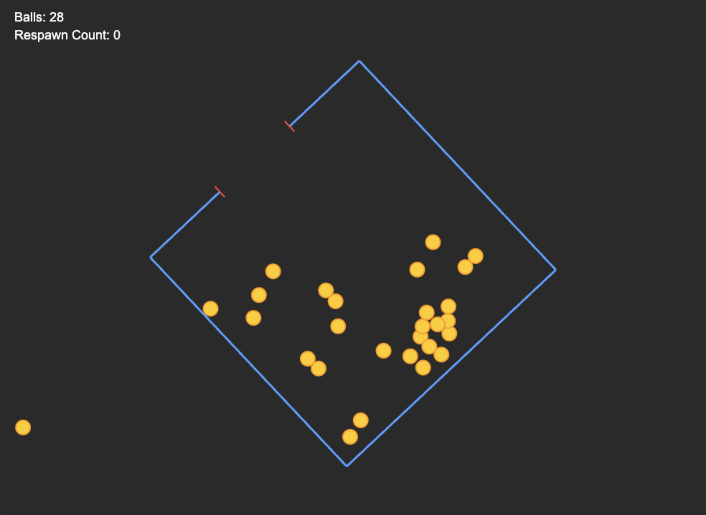

# 2D Ball Bounce Physics Simulator

A real-time physics simulation featuring bouncing balls inside a rotating container. Built with vanilla JavaScript, HTML5 Canvas, and CSS.



## Features

- **Realistic Physics**: Gravity (9.8 m/s²), 100% elastic collisions, zero friction
- **Rotating Container**: 400x400px square that rotates continuously (1 revolution per 10 seconds)
- **Dynamic Gap**: 1/3 edge-length gap in the top edge that rotates with the container
- **Ball Spawning**: Balls can escape through the gap and respawn at the center
- **Respawn Queue**: Smart spawning system prevents ball overlap
- **Responsive Design**: Automatically fills the browser viewport
- **Collision Detection**: Ball-to-ball and ball-to-container edge collisions

## How It Works

1. **Initial State**: Simulation starts with 1 ball at the center with random velocity
2. **Physics**: Balls fall due to gravity and bounce off each other and container walls
3. **Escape & Respawn**: When a ball travels beyond the corner distance from screen center, it's removed and adds 2 balls to the respawn queue
4. **Smart Spawning**: New balls spawn at the center only when there's sufficient space to prevent overlap

## Getting Started

### Prerequisites

- A modern web browser (Chrome, Firefox, Safari, or Edge)
- No build tools or dependencies required!

### Running the Simulation

1. **Clone or download this repository**
   ```bash
   git clone <repository-url>
   cd 2d-ball-bounce-simJS
   ```

2. **Open in browser**

   Simply open the `index.html` file in your web browser:

   - **Option 1**: Double-click `index.html`
   - **Option 2**: Right-click `index.html` → "Open with" → Choose your browser
   - **Option 3**: Drag `index.html` into an open browser window

3. **Watch the simulation!**

   The simulation starts automatically. You'll see:
   - **Balls**: Yellow/orange circles bouncing around
   - **Container**: Blue rotating square with a gap (marked by red indicators)
   - **Info Display**:
     - "Balls: X" - Current number of active balls
     - "Respawn Count: X" - Number of balls waiting to spawn

### Using a Local Server (Optional)

For a better development experience, you can use a local server:

```bash
# Using Python 3
python -m http.server 8000

# Using Python 2
python -m SimpleHTTPServer 8000

# Using Node.js (http-server)
npx http-server
```

Then open `http://localhost:8000` in your browser.

## Editing the Project in VS Code

### Setup

1. **Open the project in VS Code**
   ```bash
   code /Users/davidgardner/Code/2d-ball-bounce-simJS
   ```

2. **Install recommended extensions** (optional but helpful):
   - **Live Server**: Launch a development server with live reload
     - Extension ID: `ritwickdey.LiveServer`
     - After installing, right-click `index.html` → "Open with Live Server"
   - **JavaScript (ES6) code snippets**: For code completion
   - **Path Intellisense**: Autocomplete for file paths

### Project Structure

```
2d-ball-bounce-simJS/
├── index.html              # Main HTML entry point
├── styles.css              # Styling for canvas and layout
├── js/
│   ├── main.js            # Game loop, initialization, respawn logic
│   ├── Ball.js            # Ball class with physics properties
│   ├── Container.js       # Rotating container with gap
│   ├── Physics.js         # Collision detection and resolution
│   └── Renderer.js        # Canvas rendering system
└── README.md              # This file
```

### Key Files to Edit

#### **[js/main.js](js/main.js)** - Game Loop & Logic
- `init()`: Initialize the simulation
- `update(dt)`: Update physics each frame
- `checkRespawns()`: Detect balls that should respawn
- `processRespawnQueue()`: Spawn new balls when space is available

#### **[js/Ball.js](js/Ball.js)** - Ball Physics
- `update(dt)`: Update ball position
- `applyGravity(dt)`: Apply gravitational acceleration
- Ball properties: `x`, `y`, `vx`, `vy`, `radius`, `mass`

#### **[js/Container.js](js/Container.js)** - Rotating Container
- `update(dt)`: Update rotation
- `transformToLocal()`: Convert global → local coordinates
- `transformToGlobal()`: Convert local → global coordinates
- `getEdges()`: Get the 4 edges with normals
- `isPointInGap()`: Check if a point is in the gap

#### **[js/Physics.js](js/Physics.js)** - Collision System
- `ballToBallCollision()`: Handle elastic ball-to-ball collisions
- `ballToContainerCollision()`: Handle ball-to-wall collisions with rotation
- `rotateVector()`: Transform vectors for rotation

#### **[js/Renderer.js](js/Renderer.js)** - Drawing
- `drawContainer()`: Draw the rotating square with gap
- `drawBall()`: Draw individual balls
- `drawInfo()`: Display ball count and respawn queue

### Customization Examples

#### Change Ball Size
In [js/Ball.js](js/Ball.js):
```javascript
this.radius = 15; // Change from 10 to 15 (30px diameter)
```

#### Adjust Gravity
In [js/Ball.js](js/Ball.js):
```javascript
const gravity = 1500; // Increase from 980 for stronger gravity
```

#### Modify Container Size
In [js/main.js](js/main.js):
```javascript
container = new Container(SCREEN_CENTER_X, SCREEN_CENTER_Y, 600); // Change from 400
```

#### Change Rotation Speed
In [js/Container.js](js/Container.js):
```javascript
this.rotationSpeed = (2 * Math.PI) / 5; // 1 revolution every 5 seconds (was 10)
```

#### Adjust Gap Size
In [js/Container.js](js/Container.js):
```javascript
this.gapLength = size / 2; // Make gap half the edge (was 1/3)
```

#### Change Ball Colors
In [js/Renderer.js](js/Renderer.js):
```javascript
ctx.fillStyle = '#00ff00'; // Green balls (was #ffcc00)
ctx.strokeStyle = '#00cc00'; // Dark green outline
```

#### Modify Ball Speed Range
In [js/Physics.js](js/Physics.js):
```javascript
static randomVelocity(minSpeed = 300, maxSpeed = 600) { // Faster balls
```

#### Adjust Respawn Distance
In [js/main.js](js/main.js):
```javascript
if (distance > CORNER_DISTANCE * 0.8) { // Respawn at 80% of corner distance
```

## Physics Parameters

| Parameter | Value | Location |
|-----------|-------|----------|
| Gravity | 980 px/s² (9.8 m/s²) | [Ball.js:19](js/Ball.js#L19) |
| Ball Radius | 10 px | [Ball.js:7](js/Ball.js#L7) |
| Ball Mass | 1 (uniform) | [Ball.js:8](js/Ball.js#L8) |
| Elasticity | 100% (no energy loss) | [Physics.js:2-59](js/Physics.js#L2-L59) |
| Friction | 0 (frictionless) | N/A |
| Container Size | 400×400 px | [main.js:38](js/main.js#L38) |
| Rotation Speed | 36°/second | [Container.js:9](js/Container.js#L9) |
| Gap Size | 133.33 px (1/3 edge) | [Container.js:12](js/Container.js#L12) |
| Initial Ball Speed | 200-400 px/s | [main.js:41](js/main.js#L41) |

## Troubleshooting

### Simulation Won't Start
- Make sure you're opening `index.html` (not a JavaScript file)
- Check browser console (F12) for error messages
- Try opening in a different browser

### Balls Pass Through Walls
- This is usually a timing issue - refresh the page
- If persistent, check that you haven't modified the collision detection logic

### Performance Issues
- Close other browser tabs
- The simulation is designed to handle many balls efficiently
- If your respawn queue is very large, balls may be waiting for space to spawn

### Balls Get Stuck Together
- This has been fixed in the latest version
- Make sure you have the updated [Physics.js](js/Physics.js) file

## Browser Compatibility

- ✅ Chrome 90+
- ✅ Firefox 88+
- ✅ Safari 14+
- ✅ Edge 90+

The simulation uses standard HTML5 Canvas and ES6 JavaScript.

## Technical Details

### Collision Detection
- **Ball-to-Ball**: Distance check with elastic collision formula
- **Ball-to-Container**: Transforms ball position to container's local coordinate system, performs line-segment distance checks, then transforms collision normal back to global coordinates

### Coordinate Systems
1. **Global Coordinates**: Screen space (0,0 at top-left)
2. **Local Coordinates**: Container's rotated reference frame (origin at container center)

### Rotation Handling
The container rotation is handled through coordinate transformations:
1. Transform ball position: Global → Local
2. Perform collision detection in local space (edges are axis-aligned)
3. Calculate collision normal in local space
4. Transform normal: Local → Global
5. Apply velocity reflection in global space

## FAQ

### Q. How do you know to read CLAUDE.md when your context window resets?

Great question! Let me explain how I handle context across sessions:

#### Context Persistence Across Sessions

**What I DON'T Have**
* Automatic memory - When my context resets, I don't automatically "remember" previous conversations
* File change history - I don't have a built-in changelog of what happened before

**What I DO Have**
1. System Reminders (What You Just Saw)

   When files are modified, the system provides me with automatic reminders showing:
   * Which files were changed
   * The actual changes (with line numbers)
   * A note that these were intentional changes

   This is what you saw at the start of this conversation - those <system-reminder> blocks showing changes to CLAUDE.md, main.js, Physics.js, etc.

2. Git History

   I can examine git commits to understand what happened:
   ```
   git log --oneline
   git diff HEAD~1
   ```

3. Project Files as Context
   
   I can read key documentation files to understand the project:
   * README.md - User-facing documentation
   * CLAUDE.md - AI development history (this is the key one!)
   * Code comments - Inline documentation
   * File structure - Understanding the architecture

#### How CLAUDE.md Helps Future Sessions
If I were in a NEW session (context reset), here's what I would do:
1. Check git status - See what files exist
1. Read README.md - Understand what the project does
1. Read CLAUDE.md - Understand:
   * Development history
   * Design decisions made
   * Bugs that were fixed (and why)
   * Architecture patterns used
   * Current state of the project

#### Example: New Session Workflow

User: "Fix the collision detection bug"

Me (new session, no memory):
1. Read CLAUDE.md → Learn that collision bugs were already fixed
2. Read Physics.js → See the current implementation
3. Ask user: "I see collision detection was fixed in the previous session 
   (division by zero handling, separation-before-velocity). Are you experiencing
   a NEW issue, or is this about something else?"

#### Why CLAUDE.md is Critical
It acts as institutional memory for AI-assisted development:

* Context for future AI sessions - Any AI can read it and understand the project
* Debugging aid - Explains WHY certain decisions were made
* Prevents rework - Documents what was already tried
* Design rationale - Explains the architecture choices

#### Current Session vs New Session

Current session (now):
* I have full conversation history
* I remember everything we discussed
* System reminders just confirm file states

New session (hypothetical):
* No conversation history
* Would read CLAUDE.md first
* System reminders would show recent changes
* Git log would show commit history

The CLAUDE.md file essentially serves as a handoff document between AI sessions, ensuring continuity even when my context resets!


## License

This project is open source and available under the MIT License.

## Contributing

Feel free to fork this project and submit pull requests with improvements!

## Credits

Built with vanilla JavaScript - no frameworks required!
